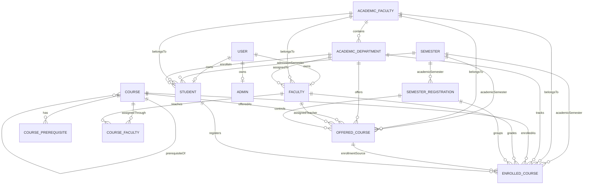

<h1 style="text-align:center">IHAM University ER Diagram</h1>

This diagram shows the implemented relationships between the backend modules and their database models.

## ER Diagram

## Relationship Notes

- `User` is the authentication record. `Student`, `Faculty`, and `Admin` are role-specific profile collections linked one-to-one to `User`.
- `Semester` is the academic term collection. It is referenced by `Student`, `SemesterRegistration`, `OfferedCourse`, and `EnrolledCourse`.
- `AcademicFaculty` is the top-level academic grouping, while `AcademicDepartment` belongs to one `AcademicFaculty`.
- `Student` and `Faculty` both belong to an `AcademicDepartment`, and each profile also carries an `academicFaculty` reference for faster lookup.
- `Course` uses embedded prerequisite records that point back to other `Course` documents, creating a self-referencing prerequisite chain.
- `CourseFaculty` is a join collection that maps one course to many faculty members.
- `SemesterRegistration` represents the lifecycle state for a semester and acts as the parent for offered courses.
- `OfferedCourse` ties together the semester registration, academic semester, faculty, department, and course for a specific scheduled section.
- `EnrolledCourse` records a student’s registration in an offered course, stores marks, computes grades, and keeps the enrollment linked to the course and faculty involved.

## Implementation Notes

- Most relationships are implemented with Mongoose `ref` fields and population.
- Some relationships are enforced by service-layer validation, such as department-to-faculty consistency and course prerequisite resolution.
- The `EnrolledCourse.offeredCourse` reference is intended to point to the offered-course collection; the current model uses a slightly different ref name in code, but the logical relationship remains the same.