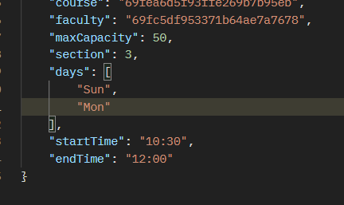

- [ **OfferedCourse** ] any faculty can have class on same section in different days with different timeslot or same timeslot
  - course | section | time | days
  - same course | same section | same time | different days
  - same course | same section | different time | different days
  - same course | different section | same time | different days
  - same course | different section | different time | same day or different day
  - different course | same section | same time | different days
  - different course | same section | different time | different days
  - different course | different section | same time | different days
  - different course | different section | different time | same day or different day

- [ **Send mail function** ]
  ```js
  //object for sendmail function
  await transporter.sendMail({
    from: '...',
    ...object, //{to, subject, text, html}
  });
  ```

- [ **Update profile picture for student, faculty or admin** ]
  > Profile picture update option should be added. maybe on the same update route or different route for only file upload

- 
